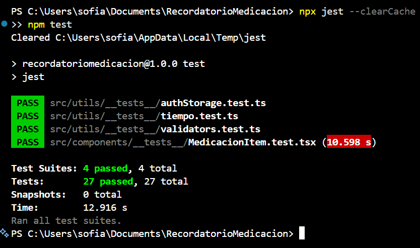

# 💊 Recordatorio de Medicación

Parcial 1 – Aplicaciones Móviles (React Native + Expo SDK 57)

## Opción elegida

**Recordatorio de medicación**: el usuario registra sus medicamentos con nombre y hora, y la app le envía una notificación local para recordarle la toma.

## Cómo ejecutar la app

```bash
npm install
npx expo start
```

Escanear el QR con **Expo Go** (Android/iOS) o presionar `a` para abrir en un emulador Android.

### Tests

```bash
npm test
```



## Funcionalidades implementadas

- **Registro** con usuario y contraseña. El usuario tiene que ser un email **@gmail.com**, la contraseña de al menos 6 caracteres y no se puede repetir el usuario.
- **Login** validando que el usuario sea un @gmail.com y contra los usuarios guardados en AsyncStorage.
- **Protección de pantallas**: sin sesión iniciada solo se puede acceder a Login y Registro (`AuthContext` + navegación condicional).
- **Sesión persistente**: si el usuario no cerró sesión, al volver a abrir la app entra directo a Home.
- **Home**: lista de medicaciones del usuario logueado, con opción de **eliminar** y **cerrar sesión**.
- **Alta de medicación**: nombre del medicamento y hora del recordatorio.
- **Persistencia** con AsyncStorage: cada usuario tiene su propia lista y los datos se mantienen al cerrar la app.
- **Notificación local** con `expo-notifications`: al guardar una medicación se programa un recordatorio en la cantidad de **segundos, minutos u horas** que elija el usuario.
- **Componente reutilizable**: `MedicacionItem`.
- **Tests con Jest + React Native Testing Library**:
  - `MedicacionItem` (renderizado e interacción con el botón eliminar).
  - Validaciones de formularios, incluido el email @gmail.com (`validators.ts`).
  - Conversión de segundos/minutos/horas para la notificación (`tiempo.ts`).
  - Lógica de registro, login y sesión (`authStorage.ts`).

## Estructura

```
src/
├── components/     MedicacionItem (componente reutilizable) + tests
├── context/        AuthContext (estado de sesión)
├── navigation/     AppNavigator (Stack Navigation) + tipos
├── screens/        Login, Registro, Home, AltaMedicacion
└── utils/          AsyncStorage, notificaciones, validaciones + tests
```

## Video demo

🎥 [Ver demo en YouTube](https://www.youtube.com/shorts/yBNPnYDb3AQ)

